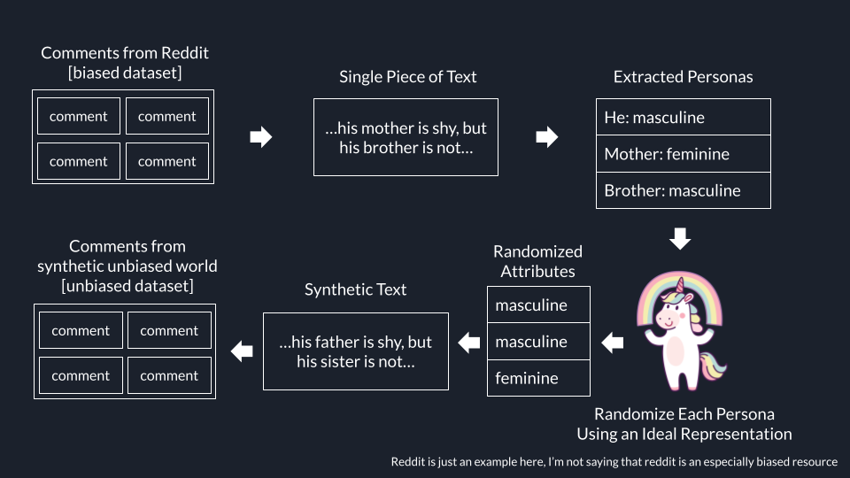

# Truly Unbiased

## Motivation

Large language models have achieved remarkable capabilities; however, a major limitation is their tendency to exhibit harmful biases across various attributes such as gender, race, age, and others. These biases originate from training data that often reflects societal biases and imbalances. Current de-biasing approaches, including data augmentation, filtering, and token replacement, are limited in their capacity to fundamentally alter the underlying data distributions.

Imagine raising our LLM in a carefully curated, bias-free environment.

The goal of this project is to generate truly unbiased large language models by fine-tuning them on carefully de-biased datasets that simulate an equitable world across attributes like gender and race.

## How It Works

We are creating a dataset that is free of bias to fine-tune LLMs on. 

The input is a regular biased dataset with real world data.

Each single piece of text is processed separately. For example: `...his mother is shy, but his brother is not...`.

We extract the personas from the text: `he`, `mother`, `brother`, and then assign randomised genders to break away from stereotypical associations. We use actual pseudo randomness to get a desired distribution of attributes in the dataset.

For example, new random genders can be `male, male, female`, then we reconstruc the original text changing the genders `...his father is shy, but his sister is not...`

After processing each item in the dataset, we have a new dataset with much less bias for the attributes we processed. We fine-tune the LLMs using this syntetic data, we call it intersectional finetuning.

## Limitations

There are several limitations and points to consider, the main one is that the idea of simulating an equitable world involves subjective decisions about what is considered equitable, often influenced by current societal norms and values which are themselves subject to debate and change. We should mitigate the risks of a single group imposing their own norms and biases.

Additionally, there's a risk of overcorrecting and creating datasets that do not accurately reflect any real-world population or scenario. This can result in AI models that are idealistic but not pragmatic, which might not perform well in real-world applications, for example failing to recognize hate speech because it was never exposed to it.

Removing or altering data to achieve an unbiased state might strip away contextually important information. For example, in healthcare, certain conditions are more prevalent in specific demographics, and ignoring these patterns can lead to poorer health outcomes.

To get widespread credibility and acceptance, as well as to make sure we are benefitting humanity, the approach to bias in AI must stay transparent and open to public criticism.
